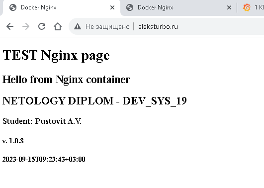

# Дипломная работа
## по курсу "DevOps-инженер"
## группа: DevOps-19
## студент: <strong>Пустовит Александр Викторович</strong>
==========================================================

## Создание облачной инфраструктуры

В данном проекте будем использовать облачную инфраструктуру в ЯндексОблаке (ЯО) при помощи  инструмента Terraform.

1. Подготовим сервисный аккаунт:

```tf
// Create SA
resource "yandex_iam_service_account" "sa-terraform" {
    name      = "sa-terraform"
}

// Grant permissions
resource "yandex_resourcemanager_folder_iam_member" "terraform-editor" {
    folder_id = var.yandex_folder_id
    role      = "editor"
    member    = "serviceAccount:${yandex_iam_service_account.sa-terraform.id}"
    depends_on = [yandex_iam_service_account.sa-terraform]
}

// Create Access Keys
resource "yandex_iam_service_account_static_access_key" "sa-static-key" {
    service_account_id = yandex_iam_service_account.sa-terraform.id
    description        = "access key"
}
```

2. Настроим workspaces:

```bash
[root@oracle terraform]# terraform workspace list 
  default
  prod
* stage

[root@oracle terraform]# terraform workspace select stage

[root@oracle terraform]# terraform workspace show
stage
```


3. Подготовим backend для Terraform посредством размещения "terraform.tfstate" в S3 bucket в созданном ЯО:

[backend TF](/terraform/bknd/bucket.tf)

- настраиваем инфраструктуру на хранение состояния в S3:

```bash
backend "s3" {
    endpoint   = "storage.yandexcloud.net"
    bucket     = "trfrm-tf-bucket"
    region     = "ru-central1"
    key        = "terraform.tfstate"

    skip_region_validation      = true
    skip_credentials_validation = true
  }
```

- переносим хранение tfstate в S3 bucket в созданном ЯО

```bash
[aleksturbo@oracle terraform]$ terraform init -backend-config="access_key=$ACCESS_KEY" -backend-config="secret_key=$SECRET_KEY"

Initializing the backend...

Initializing provider plugins...
- Reusing previous version of yandex-cloud/yandex from the dependency lock file
- Reusing previous version of hashicorp/local from the dependency lock file
- Using previously-installed yandex-cloud/yandex v0.97.0
- Using previously-installed hashicorp/local v2.4.0

Terraform has been successfully initialized!
```


4. Создадим VPC с подсетями в разных зонах доступности:

[backend TF](/terraform/network.tf)

```tf
resource "yandex_vpc_network" "subnet-zones" {
  name = "lab-net"
}

resource "yandex_vpc_subnet" "subnet-zones" {
  count          = 3
  name           = "subnet-${terraform.workspace}-${var.subnet-zones[count.index]}"
  zone           = "${var.subnet-zones[count.index]}"
  network_id     = "${yandex_vpc_network.subnet-zones.id}"
  v4_cidr_blocks = [ "${var.cidr.stage[count.index]}" ]
}
```

5. Выполнение команд terraform destroy и terraform apply:

```bash
[root@oracle terraform]# terraform apply -auto-approve
yandex_vpc_network.subnet-zones: Refreshing state... [id=enp0vphumjjlsrcsubin]
yandex_vpc_subnet.subnet-zones[2]: Refreshing state... [id=b0ch30ql8rb0j5aj8oq5]
yandex_vpc_subnet.subnet-zones[0]: Refreshing state... [id=e9bi90quseg2ll9udv0c]
yandex_vpc_subnet.subnet-zones[1]: Refreshing state... [id=e2l51va1qdgdf8isg504]
yandex_compute_instance.cluster-k8s[2]: Refreshing state... [id=ef3tmmmjmn1okai4igju]
yandex_compute_instance.cluster-k8s[0]: Refreshing state... [id=fhmku2n819k96epirphe]
yandex_compute_instance.cluster-k8s[1]: Refreshing state... [id=epdm43p97b9njggko3of]

No changes. Your infrastructure matches the configuration.

Terraform has compared your real infrastructure against your configuration and found no differences, so no changes are needed.

Apply complete! Resources: 0 added, 0 changed, 0 destroyed.

Outputs:

external_ip_address_nodes = {
  "stage-node-0" = "158.160.47.0"
  "stage-node-1" = "84.252.141.35"
  "stage-node-2" = "51.250.43.56"
}
internal_ip_address_nodes = {
  "stage-node-0" = "10.10.10.27"
  "stage-node-1" = "10.10.20.34"
  "stage-node-2" = "10.10.30.32"
}
```

- В результате отработки terraform автоматически формируется inventory для KubeSpray:

```bash
// Create inventory for KubeSpray
resource "local_file" "inventory" {
  count   = 3
  content  = <<EOT
[all]
node1 ansible_host=${yandex_compute_instance.cluster-k8s[0].network_interface.0.nat_ip_address}
node2 ansible_host=${yandex_compute_instance.cluster-k8s[1].network_interface.0.nat_ip_address}
node3 ansible_host=${yandex_compute_instance.cluster-k8s[2].network_interface.0.nat_ip_address}
...
EOT
  filename = "../kubespray/inventory/inventory.ini"
```

[inventory ](/kubespray/inventory/inventory.ini)

6. Результат выполнения раздела №1


-


## Создание Kubernetes кластера

1. При помощи Terraform подготовим  3 виртуальных машины Compute Cloud для создания Kubernetes-кластера. Учитываем workspace.

[nodes ](/terraform/nodes.tf)

```bash
resource "yandex_compute_instance" "cluster-k8s" {  
  count   = 3
  name                      = "${terraform.workspace}-node-${count.index}"
  zone                      = "${var.subnet-zones[count.index]}"
  hostname                  = "${terraform.workspace}-node-${count.index}"
  allow_stopping_for_update = true
  labels = {index = "${terraform.workspace}-node-${count.index}"} 
```

2. Для развертывания кластера используем Kubespray.

[inventory ](/kubespray/inventory/inventory.ini)

```ini
node1 ansible_host=158.160.47.0
node2 ansible_host=84.252.141.35
node3 ansible_host=51.250.43.56
```

```bash
[root@oracle kubespray]# ansible-playbook /kubespray/cluster.yml -u ubuntu -b -v -i /home/aleksturbo/ntlg-diplom-pustovit/kubespray/inventory/inventory.ini
Using /kubespray/ansible.cfg as config file
[WARNING]: Skipping callback plugin 'ara_default', unable to load

PLAY [Check Ansible version] ****************************************************************************************************************************************************
Wednesday 06 September 2023  21:01:48 +0300 (0:00:00.024)       0:00:00.024 ******
.......
.......
TASK [network_plugin/calico : Check if inventory match current cluster configuration] *******************************************************************************************************
ok: [node1] => {
    "changed": false,
    "msg": "All assertions passed"
}
Wednesday 06 September 2023  21:26:48 +0300 (0:00:00.203)       0:26:29.695 ***
Wednesday 06 September 2023  21:26:48 +0300 (0:00:00.054)       0:26:29.750 ***
Wednesday 06 September 2023  21:26:48 +0300 (0:00:00.060)       0:26:29.810 ***

PLAY RECAP **********************************************************************************************************************************************************************************
localhost                  : ok=3    changed=0    unreachable=0    failed=0    skipped=0    rescued=0    ignored=0
node1                      : ok=751  changed=152  unreachable=0    failed=0    skipped=1283 rescued=0    ignored=8
node2                      : ok=511  changed=94   unreachable=0    failed=0    skipped=783  rescued=0    ignored=1
node3                      : ok=511  changed=94   unreachable=0    failed=0    skipped=782  rescued=0    ignored=1

Wednesday 06 September 2023  21:26:48 +0300 (0:00:00.219)       0:26:30.030 ***
===============================================================================
download : Download_file | Download item 
download : Download_file | Download item 
kubernetes/preinstall : Install packages requirements 
download : Download_container | Download image if required 
download : Download_file | Download item 
download : Download_file | Download item 
container-engine/nerdctl : Download_file | Download item 
container-engine/containerd : Download_file | Download item 
container-engine/crictl : Download_file | Download item 
container-engine/runc : Download_file | Download item 
container-engine/crictl : Extract_file | Unpacking archive 
container-engine/nerdctl : Extract_file | Unpacking archive 
kubernetes-apps/ansible : Kubernetes Apps | Lay Down CoreDNS templates 
container-engine/containerd : Download_file | Validate mirrors 
container-engine/crictl : Download_file | Validate mirrors 
container-engine/runc : Download_file | Validate mirrors 
network_plugin/calico : Wait for calico kubeconfig to be created 
container-engine/nerdctl : Download_file | Validate mirrors 
kubernetes/control-plane : Kubeadm | Initialize first master 
etcdctl_etcdutl : Download_file | Download item 

```

3. Результат выполнения раздела №2:


-

-


```bash
root@node1:~# kubectl get nodes -o wide
NAME    STATUS   ROLES           AGE   VERSION   INTERNAL-IP   EXTERNAL-IP   OS-IMAGE             KERNEL-VERSION      CONTAINER-RUNTIME
node1   Ready    control-plane   47h   v1.27.5   10.10.10.27   <none>        Ubuntu 20.04.6 LTS   5.4.0-156-generic   containerd://1.7.5
node2   Ready    <none>          47h   v1.27.5   10.10.20.34   <none>        Ubuntu 20.04.6 LTS   5.4.0-156-generic   containerd://1.7.5
node3   Ready    <none>          47h   v1.27.5   10.10.30.32   <none>        Ubuntu 20.04.6 LTS   5.4.0-156-generic   containerd://1.7.5
root@node1:~# kubectl get all --all-namespaces
NAMESPACE       NAME                                            READY   STATUS    RESTARTS      AGE
gitlab-runner   pod/gitlab-runner-75769bd964-tnddr              1/1     Running   0             12h
kube-system     pod/calico-kube-controllers-5c5b57ffb5-wp8pk    1/1     Running   0             5h3m
kube-system     pod/calico-node-dl579                           1/1     Running   0             47h
kube-system     pod/calico-node-qtc6r                           1/1     Running   0             47h
kube-system     pod/calico-node-xjkvp                           1/1     Running   0             47h
kube-system     pod/coredns-5c469774b8-dqkct                    1/1     Running   0             47h
kube-system     pod/coredns-5c469774b8-hl9sk                    1/1     Running   0             47h
kube-system     pod/dns-autoscaler-f455cf558-zdpqf              1/1     Running   0             47h
kube-system     pod/kube-apiserver-node1                        1/1     Running   1             47h
kube-system     pod/kube-controller-manager-node1               1/1     Running   3 (12h ago)   47h
kube-system     pod/kube-proxy-2tbc4                            1/1     Running   0             47h
kube-system     pod/kube-proxy-lb8cz                            1/1     Running   0             47h
kube-system     pod/kube-proxy-xczkq                            1/1     Running   0             47h
kube-system     pod/kube-scheduler-node1                        1/1     Running   2 (12h ago)   47h
kube-system     pod/nginx-proxy-node2                           1/1     Running   0             47h
kube-system     pod/nginx-proxy-node3                           1/1     Running   0             47h
kube-system     pod/nodelocaldns-2jkrm                          1/1     Running   0             47h
kube-system     pod/nodelocaldns-6l9bm                          1/1     Running   0             47h
kube-system     pod/nodelocaldns-74p4c                          1/1     Running   0             47h
monitoring      pod/alertmanager-main-0                         2/2     Running   0             47h
monitoring      pod/alertmanager-main-1                         2/2     Running   0             47h
monitoring      pod/alertmanager-main-2                         2/2     Running   0             47h
monitoring      pod/blackbox-exporter-686c55cf76-dngwf          3/3     Running   0             47h
monitoring      pod/grafana-6ccd547d9-btvpr                     1/1     Running   0             47h
monitoring      pod/kube-state-metrics-54d7fb5478-clm28         3/3     Running   0             47h
monitoring      pod/node-exporter-c29pr                         2/2     Running   0             47h
monitoring      pod/node-exporter-h4dzg                         2/2     Running   0             47h
monitoring      pod/node-exporter-n4fb6                         2/2     Running   0             47h
monitoring      pod/prometheus-adapter-64884b4488-8clt2         1/1     Running   0             47h
monitoring      pod/prometheus-adapter-64884b4488-x2qh4         1/1     Running   0             47h
monitoring      pod/prometheus-k8s-0                            2/2     Running   0             47h
monitoring      pod/prometheus-k8s-1                            2/2     Running   0             47h
monitoring      pod/prometheus-operator-549dbd7c94-k8b89        2/2     Running   0             47h
portainer       pod/portainer-agent-59c485c667-55q4d            1/1     Running   0             46h
stage           pod/ntlg-pustovit-deployment-7465fdbd4b-656md   1/1     Running   0             6h33m
stage           pod/ntlg-pustovit-deployment-7465fdbd4b-mck9w   1/1     Running   0             6h33m

NAMESPACE     NAME                               TYPE        CLUSTER-IP      EXTERNAL-IP   PORT(S)                        AGE
default       service/kubernetes                 ClusterIP   10.233.0.1      <none>        443/TCP                        47h
kube-system   service/coredns                    ClusterIP   10.233.0.3      <none>        53/UDP,53/TCP,9153/TCP         47h
kube-system   service/kubelet                    ClusterIP   None            <none>        10250/TCP,10255/TCP,4194/TCP   47h
monitoring    service/alertmanager-main          ClusterIP   10.233.5.149    <none>        9093/TCP,8080/TCP              47h
monitoring    service/alertmanager-operated      ClusterIP   None            <none>        9093/TCP,9094/TCP,9094/UDP     47h
monitoring    service/blackbox-exporter          ClusterIP   10.233.5.45     <none>        9115/TCP,19115/TCP             47h
monitoring    service/grafana                    ClusterIP   10.233.15.179   <none>        2999/TCP                       47h
monitoring    service/grafana-2                  NodePort    10.233.4.113    <none>        3000:32300/TCP                 5h7m
monitoring    service/kube-state-metrics         ClusterIP   None            <none>        8443/TCP,9443/TCP              47h
monitoring    service/node-exporter              ClusterIP   None            <none>        9100/TCP                       47h
monitoring    service/prometheus-adapter         ClusterIP   10.233.55.135   <none>        443/TCP                        47h
monitoring    service/prometheus-k8s             ClusterIP   10.233.46.189   <none>        9090/TCP,8079/TCP              5h41m
monitoring    service/prometheus-k8s-2           NodePort    10.233.5.190    <none>        9090:32090/TCP                 5h9m
monitoring    service/prometheus-nodeport-svc    NodePort    10.233.45.78    <none>        9090:30090/TCP                 5h12m
monitoring    service/prometheus-operated        ClusterIP   None            <none>        9090/TCP                       47h
monitoring    service/prometheus-operator        ClusterIP   None            <none>        8443/TCP                       47h
portainer     service/portainer-agent            NodePort    10.233.29.238   <none>        9001:30778/TCP                 46h
portainer     service/portainer-agent-headless   ClusterIP   None            <none>        <none>                         46h
stage         service/ntlg-pustovit-deployment   NodePort    10.233.31.33    <none>        80:31080/TCP                   36h
stage         service/ntlg-pustovit-service      ClusterIP   10.233.59.116   <none>        80/TCP                         36h

NAMESPACE     NAME                           DESIRED   CURRENT   READY   UP-TO-DATE   AVAILABLE   NODE SELECTOR            AGE
kube-system   daemonset.apps/calico-node     3         3         3       3            3           kubernetes.io/os=linux   47h
kube-system   daemonset.apps/kube-proxy      3         3         3       3            3           kubernetes.io/os=linux   47h
kube-system   daemonset.apps/nodelocaldns    3         3         3       3            3           kubernetes.io/os=linux   47h
monitoring    daemonset.apps/node-exporter   3         3         3       3            3           kubernetes.io/os=linux   47h

NAMESPACE       NAME                                       READY   UP-TO-DATE   AVAILABLE   AGE
gitlab-runner   deployment.apps/gitlab-runner              1/1     1            1           12h
kube-system     deployment.apps/calico-kube-controllers    1/1     1            1           47h
kube-system     deployment.apps/coredns                    2/2     2            2           47h
kube-system     deployment.apps/dns-autoscaler             1/1     1            1           47h
monitoring      deployment.apps/blackbox-exporter          1/1     1            1           47h
monitoring      deployment.apps/grafana                    1/1     1            1           47h
monitoring      deployment.apps/kube-state-metrics         1/1     1            1           47h
monitoring      deployment.apps/prometheus-adapter         2/2     2            2           47h
monitoring      deployment.apps/prometheus-operator        1/1     1            1           47h
portainer       deployment.apps/portainer-agent            1/1     1            1           46h
stage           deployment.apps/ntlg-pustovit-deployment   2/2     2            2           36h

NAMESPACE       NAME                                                  DESIRED   CURRENT   READY   AGE
gitlab-runner   replicaset.apps/gitlab-runner-75769bd964              1         1         1       12h
kube-system     replicaset.apps/calico-kube-controllers-5c5b57ffb5    1         1         1       47h
kube-system     replicaset.apps/coredns-5c469774b8                    2         2         2       47h
kube-system     replicaset.apps/dns-autoscaler-f455cf558              1         1         1       47h
monitoring      replicaset.apps/blackbox-exporter-686c55cf76          1         1         1       47h
monitoring      replicaset.apps/grafana-6ccd547d9                     1         1         1       47h
monitoring      replicaset.apps/kube-state-metrics-54d7fb5478         1         1         1       47h
monitoring      replicaset.apps/prometheus-adapter-64884b4488         2         2         2       47h
monitoring      replicaset.apps/prometheus-operator-549dbd7c94        1         1         1       47h
portainer       replicaset.apps/portainer-agent-59c485c667            1         1         1       46h
stage           replicaset.apps/ntlg-pustovit-deployment-7465fdbd4b   2         2         2       6h33m
stage           replicaset.apps/ntlg-pustovit-deployment-75d4dc4c5c   0         0         0       7h12m

NAMESPACE    NAME                                 READY   AGE
monitoring   statefulset.apps/alertmanager-main   3/3     47h
monitoring   statefulset.apps/prometheus-k8s      2/2     47h

```

## Создание тестового приложения

1. Подготовим отдельный репозиторий для приложения на базе NGINX: 

[ntlg-pstvt-app](https://github.com/AleksTurbo/ntlg-pstvt-app)

[Dockerfile](https://github.com/AleksTurbo/ntlg-pstvt-app)

2. Регистр с собранным docker image:

[dockerhub](https://hub.docker.com/r/aleksturbo/ntlg-pstvt-app)

-


## Cистемы мониторинга и деплой приложения

1. Для целей мониторинга используем проект kube-prometheus (он включает в себя Kubernetes оператор для grafana, prometheus, alertmanager и node_exporter)

```bash
root@node1:~# cd "/root/kube-prometheus/"

root@node1:~/kube-prometheus# kubectl apply --server-side -f manifests/setup
customresourcedefinition.apiextensions.k8s.io/alertmanagerconfigs.monitoring.coreos.com serverside-applied
customresourcedefinition.apiextensions.k8s.io/alertmanagers.monitoring.coreos.com serverside-applied
customresourcedefinition.apiextensions.k8s.io/podmonitors.monitoring.coreos.com serverside-applied
customresourcedefinition.apiextensions.k8s.io/probes.monitoring.coreos.com serverside-applied
customresourcedefinition.apiextensions.k8s.io/prometheuses.monitoring.coreos.com serverside-applied
customresourcedefinition.apiextensions.k8s.io/prometheusagents.monitoring.coreos.com serverside-applied
customresourcedefinition.apiextensions.k8s.io/prometheusrules.monitoring.coreos.com serverside-applied
customresourcedefinition.apiextensions.k8s.io/scrapeconfigs.monitoring.coreos.com serverside-applied
customresourcedefinition.apiextensions.k8s.io/servicemonitors.monitoring.coreos.com serverside-applied
customresourcedefinition.apiextensions.k8s.io/thanosrulers.monitoring.coreos.com serverside-applied
namespace/monitoring serverside-applied

root@node1:~/kube-prometheus# kubectl wait \
> --for condition=Established \
> --all CustomResourceDefinition \
> --namespace=monitoring
customresourcedefinition.apiextensions.k8s.io/alertmanagerconfigs.monitoring.coreos.com condition met
customresourcedefinition.apiextensions.k8s.io/alertmanagers.monitoring.coreos.com condition met
customresourcedefinition.apiextensions.k8s.io/bgpconfigurations.crd.projectcalico.org condition met
customresourcedefinition.apiextensions.k8s.io/bgppeers.crd.projectcalico.org condition met
customresourcedefinition.apiextensions.k8s.io/blockaffinities.crd.projectcalico.org condition met
.....


deployment.apps/prometheus-operator unchanged
networkpolicy.networking.k8s.io/prometheus-operator unchanged
prometheusrule.monitoring.coreos.com/prometheus-operator-rules unchanged
service/prometheus-operator unchanged
serviceaccount/prometheus-operator unchanged
servicemonitor.monitoring.coreos.com/prometheus-operator unchanged

```

в итоге получаем служебные поды и сервисы:

```bash
root@node1:~# kubectl get po -n monitoring
NAME                                   READY   STATUS    RESTARTS   AGE
alertmanager-main-0                    2/2     Running   0          2d9h
alertmanager-main-1                    2/2     Running   0          2d9h
alertmanager-main-2                    2/2     Running   0          2d9h
blackbox-exporter-686c55cf76-dngwf     3/3     Running   0          2d9h
grafana-6ccd547d9-btvpr                1/1     Running   0          2d9h
kube-state-metrics-54d7fb5478-clm28    3/3     Running   0          2d9h
node-exporter-c29pr                    2/2     Running   0          2d9h
node-exporter-h4dzg                    2/2     Running   0          2d9h
node-exporter-n4fb6                    2/2     Running   0          2d9h
prometheus-adapter-64884b4488-8clt2    1/1     Running   0          2d9h
prometheus-adapter-64884b4488-x2qh4    1/1     Running   0          2d9h
prometheus-k8s-0                       2/2     Running   0          2d9h
prometheus-k8s-1                       2/2     Running   0          2d9h
prometheus-operator-549dbd7c94-k8b89   2/2     Running   0          2d9h

root@node1:~# kubectl get svc -n monitoring
NAME                      TYPE        CLUSTER-IP      EXTERNAL-IP   PORT(S)                      AGE
alertmanager-main         ClusterIP   10.233.5.149    <none>        9093/TCP,8080/TCP            2d9h
alertmanager-operated     ClusterIP   None            <none>        9093/TCP,9094/TCP,9094/UDP   2d9h
blackbox-exporter         ClusterIP   10.233.5.45     <none>        9115/TCP,19115/TCP           2d9h
grafana                   ClusterIP   10.233.15.179   <none>        2999/TCP                     2d9h
grafana-2                 NodePort    10.233.4.113    <none>        3000:32300/TCP               15h
kube-state-metrics        ClusterIP   None            <none>        8443/TCP,9443/TCP            2d9h
node-exporter             ClusterIP   None            <none>        9100/TCP                     2d9h
prometheus-adapter        ClusterIP   10.233.55.135   <none>        443/TCP                      2d9h
prometheus-k8s            ClusterIP   10.233.46.189   <none>        9090/TCP,8079/TCP            16h
prometheus-k8s-2          NodePort    10.233.5.190    <none>        9090:32090/TCP               15h
prometheus-nodeport-svc   NodePort    10.233.45.78    <none>        9090:30090/TCP               15h
prometheus-operated       ClusterIP   None            <none>        9090/TCP                     2d9h
prometheus-operator       ClusterIP   None            <none>        8443/TCP                     2d9h
```

- для доступа к инструментам снаружи создаем дополнительные сервисы с типом NodePort

[grafana-nodeport-svc](/kubernetes/grafana-nodeport-svc.yaml)

[prometheus-nodeport-svc](/kubernetes/prometheus-nodeport-svc.yaml)

```bash
kubectl apply -f grafana-nodeport-svc.yaml
kubectl apply -f prometheus-nodeport-svc.yaml
```


- Доступы к мониторингу:

[Prometeus](http://aleksturbo.ru:9090/)

[Grafana](http://aleksturbo.ru:3000/login)

admin/513825513825

- Развернем тестовое приложение:

[ntlg-pstvt-app](/ntlg-pstvt-app/)

[GitHUB](https://github.com/AleksTurbo/ntlg-pstvt-app)

```bash
kubectl apply -f manifest.yaml


[aleksturbo@oracle terraform]$ kubectl get po -n stage
NAME                                        READY   STATUS    RESTARTS   AGE
ntlg-pustovit-deployment-775f78b45c-55lnh   1/1     Running   0          40m
ntlg-pustovit-deployment-775f78b45c-knx7z   1/1     Running   0          40m

[aleksturbo@oracle terraform]$ kubectl get svc -n stage
NAME                       TYPE        CLUSTER-IP      EXTERNAL-IP   PORT(S)        AGE
ntlg-pustovit-service      ClusterIP   10.233.41.72    <none>        80/TCP         40m
ntlg-pustovit-service-np   NodePort    10.233.27.252   <none>        80:30008/TCP   40m
```

Диагностический доступ получаем через NodePort


- Организуем доступ к приложению и сервисам мониторинга посредством Network Load Balancer YC


## Установка и настройка CI/CD

1. Для реализации процесса автоматизированного развертывания применим инструмент GitLab CI

[GitLab CI](https://gitlab.com/AleksTurbo/ntlg-pstvt-app)

- сборка приложения происходит при каждом коммите, но деплой приложения производится при присваивании тега=релиза

```yaml
release:
  image:
    name: lachlanevenson/k8s-kubectl:latest
    entrypoint: ["/bin/sh", "-c"]
  stage: release
  tags:
    - runner
  rules:
      - if: '$CI_COMMIT_TAG'
```
[gitlab-ci](/ntlg-pstvt-app/.gitlab-ci.yml)


-


2. Для сборки docker образа используем инструмент kaniko

```yaml
stage: build
  image:
    name: gcr.io/kaniko-project/executor:v1.9.0-debug
```

3. Результат сборки отправляем на ресурс "hub.docker.com"

[DockerHUB](https://hub.docker.com/r/aleksturbo/ntlg-pstvt-app)


4. Деплой новой версии сборки производим при помощи инструмента "lachlanevenson/k8s-kubectl"

- процесс установки новой версии производится скриптом:

```.yml
  script:
    - sed -i "s/__VERSION__/${VERSION}.${CI_PIPELINE_ID}/" manifest.yaml
    - kubectl get replicasets -n stage -o wide
    - kubectl apply -n stage -f manifest.yaml
```

- наблюдаем процесс обновления PODов в кластере

```bash
root@node1:~# kubectl get po -n stage
NAME                                        READY   STATUS    RESTARTS   AGE
ntlg-pustovit-deployment-7465fdbd4b-656md   1/1     Running   0          17h
ntlg-pustovit-deployment-7465fdbd4b-mck9w   1/1     Running   0          17h
root@node1:~# kubectl get svc -n stage
NAME                       TYPE        CLUSTER-IP      EXTERNAL-IP   PORT(S)        AGE
ntlg-pustovit-deployment   NodePort    10.233.31.33    <none>        80:31080/TCP   46h
ntlg-pustovit-service      ClusterIP   10.233.59.116   <none>        80/TCP         46h
root@node1:~# ^C
root@node1:~# kubectl get po -n stage -w
NAME                                        READY   STATUS    RESTARTS   AGE
ntlg-pustovit-deployment-565bd4cfff-8mc8p   1/1     Running   0          3m45s
ntlg-pustovit-deployment-565bd4cfff-f79jn   1/1     Running   0          3m50s
ntlg-pustovit-deployment-7769b897bc-4x2xj   0/1     Pending   0          0s
ntlg-pustovit-deployment-7769b897bc-4x2xj   0/1     Pending   0          0s
ntlg-pustovit-deployment-7769b897bc-4x2xj   0/1     ContainerCreating   0          0s
ntlg-pustovit-deployment-7769b897bc-4x2xj   0/1     ContainerCreating   0          1s
ntlg-pustovit-deployment-7769b897bc-4x2xj   1/1     Running             0          5s
ntlg-pustovit-deployment-565bd4cfff-f79jn   1/1     Terminating         0          9m4s
ntlg-pustovit-deployment-7769b897bc-nw785   0/1     Pending             0          0s
ntlg-pustovit-deployment-7769b897bc-nw785   0/1     Pending             0          0s
ntlg-pustovit-deployment-7769b897bc-nw785   0/1     ContainerCreating   0          0s
ntlg-pustovit-deployment-565bd4cfff-f79jn   1/1     Terminating         0          9m4s
ntlg-pustovit-deployment-565bd4cfff-f79jn   0/1     Terminating         0          9m4s
ntlg-pustovit-deployment-565bd4cfff-f79jn   0/1     Terminating         0          9m5s
ntlg-pustovit-deployment-7769b897bc-nw785   0/1     ContainerCreating   0          1s
ntlg-pustovit-deployment-565bd4cfff-f79jn   0/1     Terminating         0          9m5s
ntlg-pustovit-deployment-565bd4cfff-f79jn   0/1     Terminating         0          9m5s
ntlg-pustovit-deployment-7769b897bc-nw785   1/1     Running             0          5s
ntlg-pustovit-deployment-565bd4cfff-8mc8p   1/1     Terminating         0          9m4s
ntlg-pustovit-deployment-565bd4cfff-8mc8p   1/1     Terminating         0          9m4s
ntlg-pustovit-deployment-565bd4cfff-8mc8p   0/1     Terminating         0          9m4s
ntlg-pustovit-deployment-565bd4cfff-8mc8p   0/1     Terminating         0          9m5s
ntlg-pustovit-deployment-565bd4cfff-8mc8p   0/1     Terminating         0          9m5s
ntlg-pustovit-deployment-565bd4cfff-8mc8p   0/1     Terminating         0          9m5s

```

5. Получаем результат

[NGINX`s APP](http://aleksturbo.ru/)

